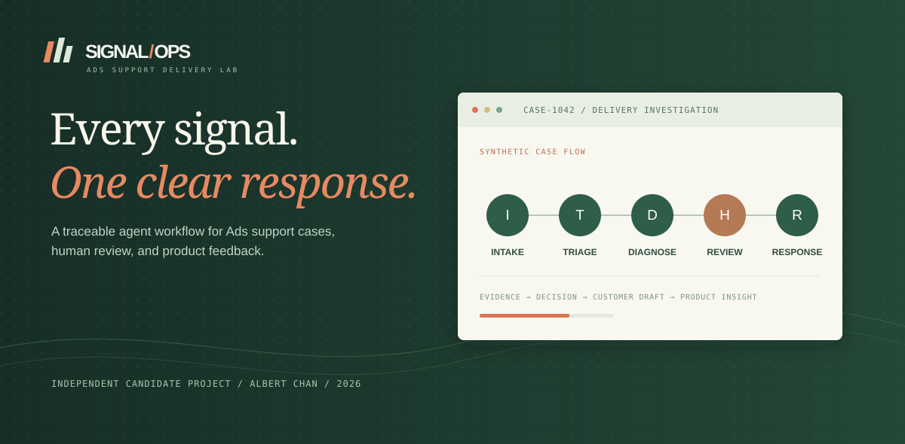
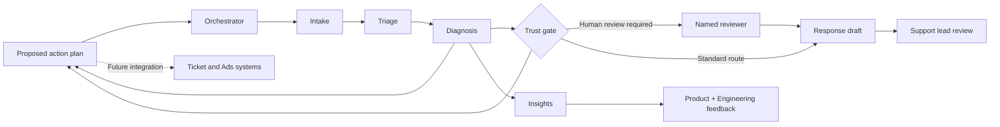

# Signal/Ops: Ads Support Delivery Lab



**An independent candidate project by Albert Chan.** This repository shows how I would design an Ads support delivery system that makes technical investigations faster while keeping evidence, customer guidance, and sensitive decisions under human control. The five cases, customers, metrics, and agent outputs are synthetic. This project has no access to OpenAI systems or customer data.

**[Explore the public demo](https://victorvictory88.github.io/Support-Delivery-Lead/)**

## Try the demo

Requires Node.js 20.19+ or 22.12+ and npm.

```bash
npm ci
npm run dev
```

Open `http://127.0.0.1:5173` and choose any case from the five cards at the top. The page immediately shows the finding, evidence, review owner, proposed action plan, response draft, and product feedback. Each plan names an owner, an open dependency, proof to record, an update plan, and a resolution condition. The agent team view cycles through the seven role handoffs automatically. The core simulation runs offline after installation.

The left rail shows the selected case's operating decision, next handoff, and resolution check. It also shows the current priority, route, reviewer, and human review reason. Brief explanations appear when a visitor hovers over or focuses key labels, metrics, the signal chart label, and agent roles. The animated handoff view replays the stored seven-stage trace; the domain engine computes the case result synchronously.

```bash
npm run check   # domain tests and production build
npm run eval    # synthetic fixture scorecard
```

## Public site

The [live demo](https://victorvictory88.github.io/Support-Delivery-Lead/) is published from the `main` branch by [GitHub Actions](.github/workflows/deploy.yml). The build uses the repository path for its assets. The public page runs the five sample cases in the browser; the optional draft API remains a local developer tool. Local `.env` files and installed dependencies are excluded from Git, while `.env.example` contains empty values.

## What this demonstrates

| Capability                 | Where to see it                                                              |
| -------------------------- | ---------------------------------------------------------------------------- |
| Ads issue diagnosis        | Five delivery, measurement, billing, policy, and launch simulations          |
| Operational prioritization | Severity, account scope, exposure estimate, and decision window              |
| Agent orchestration        | Animated role handoffs and a seven-step trace with evidence links            |
| Human oversight            | Named review gates for billing, policy, launch, severe, and uncertain cases  |
| Operational handoff        | Case-specific decisions, owners, dependencies, update plans, and exit checks |
| Response communication     | Customer or internal draft that stays inside the prototype                   |
| Product feedback           | A recurring-issue recommendation attached to every case                      |
| Engineering discipline     | Typed domain model, deterministic core, tests, evaluation, and CI            |

## How a support lead would use the output

The support lead can select a case, compare the finding with cited records, and check the priority and assigned route. The handoff card then identifies the operating decision, each owner's next action, the proof needed to advance, the customer update plan, and the condition for resolution. For CASE-1042, the recorded payment event supports the initial diagnosis; the advertiser and Billing Ops still need to clear the payment issue, and Support must verify serving recovery before closing the case.

The interface stages a proposed handoff. It has no authenticated Ads Manager connection, ticket updates, payment actions, policy decisions, or outbound send. A production deployment would need those integrations, reviewer identity, permissions, and an audit log. Use career examples in the interview to cover team coaching and performance management. The case flow focuses on technical support operations.

For an operating cadence, I would instrument time to first useful response, promised update timeliness, time to resolution, reopen rate, and specialist handoff time. Quality reviews would track evidence use, corrected findings, and approval compliance. A support lead could then inspect repeated issue types with Product and Engineering while coaching engineers on the specific steps that generate rework. This repository defines those measures without inventing live performance data.

## Architecture at a glance



The domain engine owns the finding, severity, routing, evidence IDs, action plan, and approval policy. The optional model endpoint can rewrite a draft when invoked directly by a developer. It cannot change the finding or clear the review gate. The UI displays the deterministic response draft and has no send action. See [architecture](docs/architecture.md) for the data flow, safeguards, and production extension plan.

## Five fictional cases

| Case      | Support challenge                                      | Expected finding        | Review route       |
| --------- | ------------------------------------------------------ | ----------------------- | ------------------ |
| CASE-1042 | Delivery falls after a failed payment attempt          | Payment failure         | Support lead       |
| CASE-2087 | Platform clicks exceed site sessions                   | Measurement discrepancy | Measurement lead   |
| CASE-3164 | Conversion objective and click billing are confused    | Billing model confusion | Billing specialist |
| CASE-4271 | Ad review flags an inaccessible landing page           | Landing page access     | Policy specialist  |
| CASE-5308 | A launch lacks a completed runbook and tested rollback | Launch readiness gap    | Launch owner       |

Each case includes a trend, typed signals, three source records, and an authored expected finding. Fictional records support the interview discussion. Read the [scenario details](docs/scenarios.md) for the full case design.

## Engineering decisions

1. **Keep the core deterministic.** Reviewers can reproduce each result without an API key or a model call.
2. **Cite the source record.** Every diagnosis and trace step lists evidence IDs, and tests reject unknown IDs.
3. **Separate a draft from an action.** The prototype prepares guidance and requires a person for sensitive decisions. Customer messages remain drafts inside the prototype.
4. **Make failure visible.** When decisive evidence is absent, the engine returns an uncertain finding and raises a human gate.
5. **Measure the risk controls.** The fixture suite checks finding matches, citation validity, review routing, action plan structure, and trace completeness. Its 100% score applies only to the five authored cases.
6. **Keep keys on the server.** The optional endpoint reads its key from the local server environment and returns draft text only to a direct caller.
7. **Exercise uncertainty in tests.** Domain tests introduce conflicting signals and broaden a case to 500 accounts. The public interface stays focused on choosing a case.

## AI-assisted build process

I supplied the role description and directed the one-click case workflow. Codex helped implement the prototype, and I reviewed the interface through several rounds of feedback. Those revisions added clearer architecture labels, short explanations, and an operator handoff with owners and resolution checks. The typed rules, fictional records, tests, and source links remain visible in this repository so a reviewer can inspect each decision. The animated agent map replays deterministic steps; the optional OpenAI API mode rewrites draft text only.

## Optional AI draft mode

The optional service may incur API charges. It accepts a direct developer request with a synthetic case ID, while the page uses the deterministic draft.

```bash
cp .env.example .env
# Set OPENAI_API_KEY and OPENAI_MODEL in .env
npm run dev:api
curl -X POST http://127.0.0.1:8787/api/draft \
  -H 'Content-Type: application/json' \
  -d '{"caseId":"CASE-1042"}'
```

The server binds to `127.0.0.1`. It submits only the selected fictional scenario, its evidence, the engine's finding, and the approval state. Set `store: false` in the Responses API request. Treat any generated prose as an unapproved draft. [OpenAI's API key guidance](https://platform.openai.com/docs/api-reference/introduction?lang=node.js) supports keeping keys out of browser code.

## Repository map

```text
src/domain/       Case types, authored fixtures, engine, evaluations, tests
src/App.tsx        Interactive operations console
src/styles.css     Responsive visual system
server/           Optional local server for AI draft rewrites
scripts/          Evaluation command
docs/             Architecture, cases, source mapping, demo guide
.github/           Continuous integration
```

## Interview walkthrough

Start with CASE-1042 and show the payment event beside the delivery decline. Follow the handoff from the recorded evidence through the advertiser dependency, serving recheck, and closure condition. Choose CASE-2087 to explain why missing URL tags leave the click-to-session discrepancy unresolved. Then choose CASE-5308 for the launch hold decision and Product and Engineering feedback loop. Finish with the quality strip and explain the limited scope of authored fixtures. Use CASE-3164 for billing questions and CASE-4271 for policy questions. The [five-minute demo guide](docs/demo-script.md) includes discussion prompts.

## Public-source boundary

This project draws on the role description and [public OpenAI Ads documentation](docs/source-map.md), accessed September 23, 2026. Product rules and documentation can change. The simulated policies and event records show the design; OpenAI's internal tooling and support process are outside this prototype.

## Author

I am Albert Chan, and my career spans advertiser operations, team leadership, and applied AI workflows. At Meta I delivered 30% year-over-year growth at 105% quota attainment against a $30B+ North America advertiser book across 100K+ accounts. I managed 5 directs, and they managed over 400 BPO sales reps across five vendors. At Rowland AI, I helped build an Agentic Org Chart with coordinated handoffs and human decision gates. This project brings those experiences into a reviewable technical artifact.
