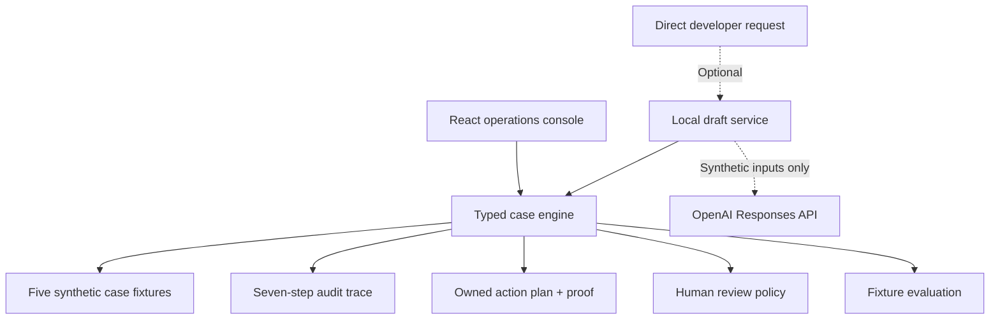

# Architecture and operating model

## Design goal

An Ads support lead needs speed, technical rigor, consistent customer guidance, and a repeatable path from support signals to product changes. Signal/Ops models those requirements with a deterministic core and an optional writing assistant. Every case can be inspected without a model call.

## System boundary

### Domain contracts

`SupportCase` is a discriminated union. Each case kind has a dedicated signal set. `RunResult` contains severity, route, finding, evidence IDs, trace, human gate, action plan, response draft, operational insight, and evidence coverage. The action plan assigns owners and states the proof needed before a case can advance or close. The engine is pure and repeatable, so each run of a case yields an identical result.

### Agent roles

| Role         | Input                           | Output                            | Boundary                       |
| ------------ | ------------------------------- | --------------------------------- | ------------------------------ |
| Orchestrator | Case ID and case state          | Ordered workflow                  | Owns handoffs                  |
| Intake       | Signals and source records      | Normalized case view              | No diagnosis                   |
| Triage       | Scope, exposure, deadline       | Severity and route                | No customer commitment         |
| Diagnosis    | Typed signals and evidence      | Finding, confidence, next check   | Must cite source IDs           |
| Trust gate   | Case kind, severity, confidence | Human review decision             | Cannot waive a specialist gate |
| Response     | Finding and review state        | Response draft                    | No outbound send               |
| Insights     | Case pattern                    | Product or process recommendation | No roadmap commitment          |

These roles are logical services inside one local process. The animated team view cycles through the resulting trace to explain handoffs. The engine computes each case once, and a production design could deploy roles separately where isolation, scale, or ownership warrants it. The prototype keeps the contracts visible without adding network complexity to the core.

## Human control

Billing, policy, and launch cases always require a named reviewer. P0 and low-confidence findings also require review. The action plan ends at a reviewer for each gated case. The interface displays the review owner and keeps the customer response as a draft. Actual charges, policy exceptions, launch decisions, and customer responses stay outside this prototype.

The optional model endpoint cannot override the gate. It receives the engine result and returns draft wording only. A production service would require authenticated reviewers, an immutable event log, role permissions, and an outbound channel with an explicit send approval.

## Evidence and uncertainty

Each fixture includes three source records with stable IDs. The finding cites those IDs. `allCitationsExist` validates provenance across the trace and action plan. When decisive signals are missing, the engine returns `insufficient_evidence`, lowers confidence, and routes the case to a person. The measurement case keeps click-to-session differences open for reconciliation; missing URL tags affect attribution while the total session gap still needs investigation. A production version would also validate source freshness, permissions, completeness, and conflicts across systems.

## Production extension path

1. Ingest authorized case, Ads Manager, billing, measurement, and review events through scoped connectors.
2. Normalize event time, source, account permissions, and customer impact into a versioned case record.
3. Add retrieval over approved product guidance and runbooks, with citations and document timestamps.
4. Run separate evaluations for diagnosis, policy safety, escalation quality, customer clarity, and repeated issues.
5. Add authenticated approval, audit storage, service health checks, and incident response hooks.
6. Roll out in shadow mode, then limited assisted mode, using measured reviewer corrections to guide changes.

An operating scorecard would track time to first useful response, promised update timeliness, resolution time, reopen rate, specialist handoff time, evidence quality, reviewer corrections, and approval compliance. The support lead would review queue health and coaching needs in a recurring cadence, while Product and Engineering would receive repeat-issue trends with source examples. These are proposed measures; the fictional cases supply no live operating baseline.

The next deployment decision would depend on privacy review, security controls, actual support workflows, and operational baselines. This repository makes no claim to represent those internal systems.
